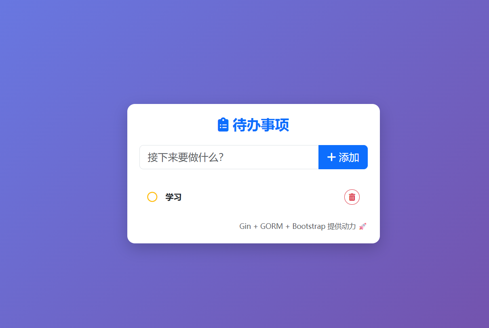

# 📝 Gin Todo List


基于 **Go (Gin)** + **GORM** + **MySQL** 构建的全栈待办事项管理系统。
项目采用标准的 **MVC 分层架构**，集成了 **Viper** 配置管理，并包含一个基于 **Bootstrap 5** 的现代化前端界面。

这是我学习 Go Web 开发的实战项目，实现了完整的 RESTful API 和数据持久化。

## ✨ 项目展示



## 🚀 功能特性

- **后端核心**
  - 使用 **Gin** 框架构建高性能 RESTful API。
  - 使用 **GORM** 进行 MySQL 数据库交互（自动建表、CRUD）。
  - 采用 **CLD (Controller-Logic-Data)** 分层架构，代码结构清晰。
  - 集成 **Viper** 读取 YAML 配置文件，实现配置与代码分离。
  - 统一的错误处理与 JSON 响应格式。

- **前端交互**
  - 原生 HTML/JS 实现，无复杂的构建流程。
  - 引入 **Bootstrap 5** 实现响应式布局，适配移动端。
  - 使用 **Fetch API** 与后端进行异步数据交互。
  - 集成 **SweetAlert2** 提供美观的弹窗交互体验。

## 🛠️ 技术栈

- **Language**: Go (Golang)
- **Web Framework**: Gin
- **ORM**: GORM
- **Database**: MySQL
- **Config**: Viper
- **Frontend**: HTML5, CSS3, JavaScript, Bootstrap 5
- **Dev Tools**: Air (用于热重载)

## 📂 目录结构

```text
gin-todo/
├── config/          # 配置加载逻辑 (Viper)
├── controllers/     # 控制层 (处理 HTTP 请求)
├── models/          # 模型层 (数据库 Struct 与 初始化)
├── routers/         # 路由层 (注册 URL)
├── static/          # 静态资源 (HTML/CSS/Images)
├── main/            # 程序入口
│   └── main.go
├── config.yaml      # 配置文件 (请根据 example 创建)
├── go.mod           # 依赖管理
└── README.md        # 项目文档
```

## ⚡️ 快速开始 (Getting Started)

### 1.克隆项目

~~~bash
git clone [https://github.com/xiaoli-lhx/gin-todo.git](https://github.com/xiaoli-lhx/gin-todo.git)
cd gin-todo
~~~

### 2. 准备数据库

确保你已安装 MySQL。登录数据库并创建一个空库：

~~~sql
CREATE DATABASE gin_todo DEFAULT CHARSET=utf8mb4 COLLATE utf8mb4_general_ci;
~~~

### 3. 配置环境

项目根目录下有一个配置文件。请修改数据库账号密码：如果提供了 `config.yaml.example`，请复制为 `config.yaml`

~~~yaml
# config.yaml
database:
  dsn: "root:你的密码@tcp(127.0.0.1:3306)/gin_todo?charset=utf8mb4&parseTime=True&loc=Local"
server:
  port: ":8080"
~~~

### 4.项目运行

#### 方式 A：使用 Go 直接运行

~~~bash
go mod tidy
go run main/main.go
~~~

#### 方式 B：使用 Air (推荐，支持热更新)

~~~bash
# 需先安装 air: go install [github.com/air-verse/air@latest](https://github.com/air-verse/air@latest)
air
~~~

### 5. 访问

打开浏览器访问：[http://localhost:8080](https://www.google.com/search?q=http://localhost:8080)

## 🔗 API 接口文档

| **方法** | **路径**    | **描述**                   |
| -------- | ----------- | -------------------------- |
| GET      | `/todo`     | 获取所有待办事项           |
| POST     | `/todo`     | 创建新的待办事项           |
| PUT      | `/todo/:id` | 修改任务状态 (完成/未完成) |
| DELETE   | `/todo/:id` | 删除指定任务               |

## 🤝 贡献 (Contributing)

欢迎提交 Issue 或 Pull Request！